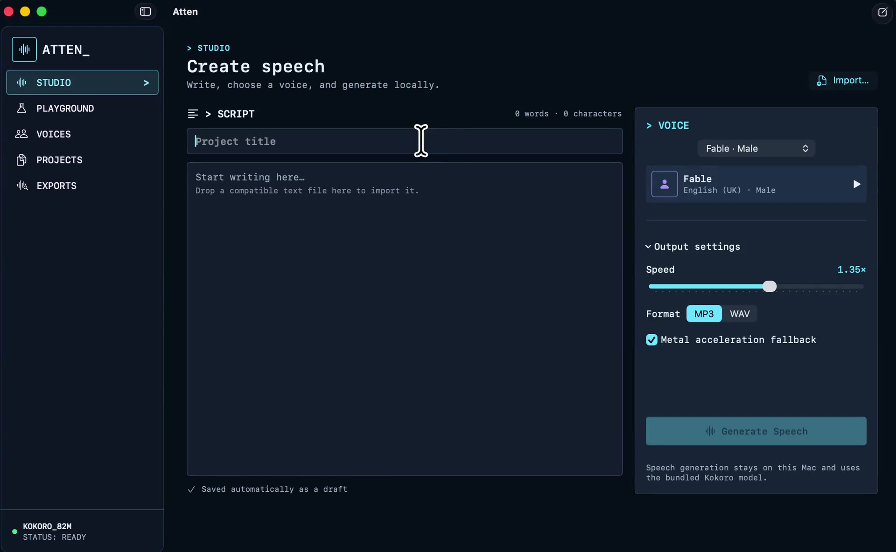

<p align="center">
  
</p>

<h1 align="center">Atten</h1>

<p align="center">
  Natural text-to-speech that runs entirely on your Mac.<br>
  No cloud. No subscription. No API key.
</p>

<p align="center">
  <a href="https://github.com/jashdubal/atten/releases/latest/download/Atten-macOS-arm64.dmg"><strong>Download for Mac</strong></a>
  ·
  <a href="https://jashdubal.github.io/atten/">Website</a>
  ·
  <a href="#command-line">Command line</a>
</p>

<p align="center">
  <sub>Free and open source · macOS 14+ · Apple Silicon</sub>
</p>

<p align="center">
  <a href="https://jashdubal.github.io/atten/atten-demo.mp4">
    
  </a>
</p>

## Local speech, without the setup

Atten is a native macOS voice studio powered by the bundled
[Kokoro 82M](https://huggingface.co/hexgrad/Kokoro-82M) model. Your text and
generated audio stay on your Mac, and the complete engine works offline after
installation.

- Create MP3 or WAV audio with 37 voices
- Preview voices, speed, format, and Metal settings in the Playground
- Keep projects and exports organized in one native app
- Import text, regenerate previous work, and export anywhere
- Use the compatible CLI for scripts and automation

## Install

1. **[Download the latest DMG](https://github.com/jashdubal/atten/releases/latest/download/Atten-macOS-arm64.dmg).**
2. Open it and drag **Atten** into **Applications**.
3. Launch Atten and start generating speech—everything required is included.

Atten currently requires an Apple Silicon Mac running macOS 14 or newer. The
release is ad-hoc signed and not yet notarized. If macOS blocks the first launch,
Control-click Atten, choose **Open**, then confirm. See the
[installation notes](DEPLOYMENT.md#user-installation-and-gatekeeper) for the
alternative Privacy & Security flow and download verification.

## Command line

The original local commands remain available for automation:

```bash
bin/tts "Living the dream"
bin/tts -f README.md -v bf_emma -s 1.1 --format wav --play
bin/tts "Hello" --filename greeting --silent
bin/play --latest
```

Machine-readable output is supported too:

```bash
bin/tts --list-voices --json
bin/tts "Hello" --json
```

Run `bin/tts --help` for every option, or browse the [voice catalog](VOICES.md).

## Develop locally

You will need an Apple Silicon Mac with macOS 14+, Xcode 16 with Swift 6,
Python 3.12, and [`uv`](https://docs.astral.sh/uv/).

```bash
bin/setup-macos
bin/atten
```

The development setup downloads roughly 350 MB of model weights. Published
DMGs already include the pinned model and do not require Python or Homebrew.

Build and open a development app bundle:

```bash
scripts/build-app
open .build/Atten.app
```

Or work on the Swift package directly:

```bash
swift build
swift run Atten
```

The development app uses the repository's backend environment. To use a
backend elsewhere, set `ATTEN_BACKEND_ROOT=/path/to/offline-tts`.

## Test

```bash
swift test
python3 -m unittest discover -s tests -v
swift build -c release
```

## Privacy and storage

- Synthesis is local and requires no account, credentials, or internet access.
- Project metadata lives in `~/Library/Application Support/Atten`.
- Generated audio defaults to the `Exports` folder inside that directory.
- Existing audio under the repository's `outputs/` folder is discovered in place.

See the [architecture notes](docs/ARCHITECTURE.md) for implementation details
and [deployment guide](DEPLOYMENT.md) for release packaging and verification.

## License

Atten is available under the [GNU GPL v3 or later](LICENSE).
